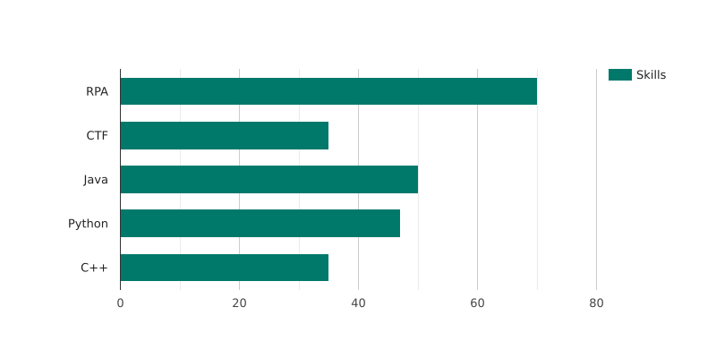

<!-- 
 --!>
    <h3 align="center">Hi, I'm Vladimir</a></h3>
    
✨ Welcome to my GitHub! ✨

    
Discover my projects and coding journey!

    <h4 align="left">My Projects:</h4>
    <table align="center">
        <tr>
            <td><a href="https://github.com/efane4m/SiteCard">SiteCard</a> - my personal website</td>
            <td><a href="https://github.com/efane4m/ScheduleBot">ScheduleBot</a> - bot for getting a schedule</td>
        </tr>
        <tr>
            <td><a href="https://github.com/P1trusHka/CrossRoad">CrossRoad</a> - platform for creating open discussions</td>
            <td><a href="https://github.com/efane4m/ControlBot">ControlBot</a> - bot for control computer</td>
        </tr>
    </table>
    

